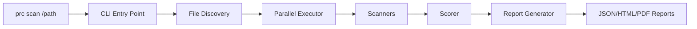
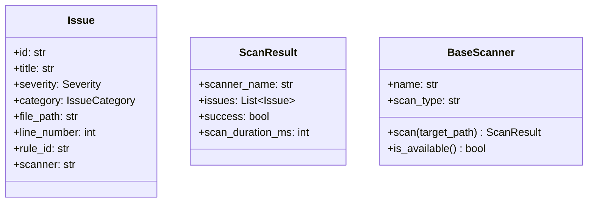
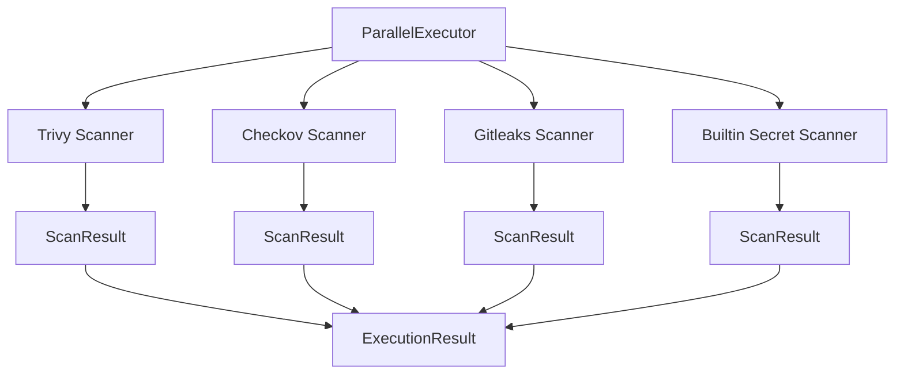
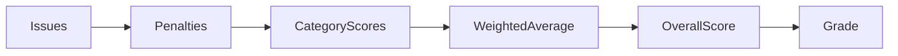
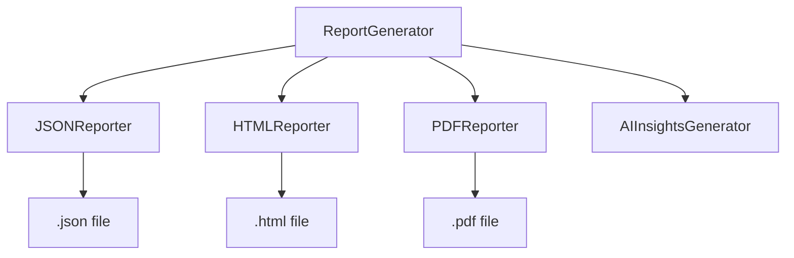
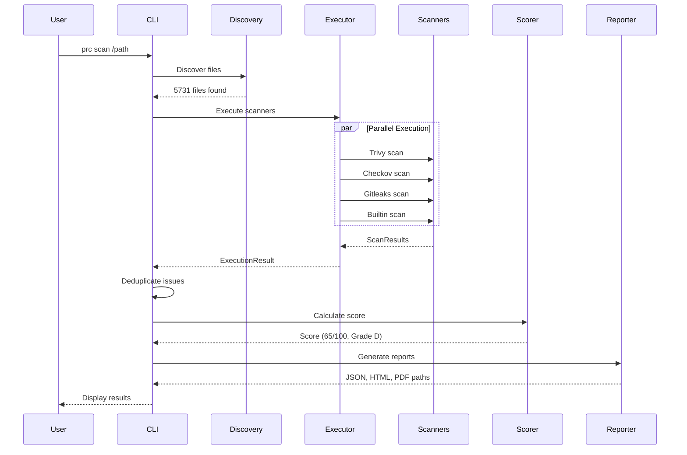

# PRC (Production Readiness Checker) - Complete Architecture Guide

## Overview

PRC is a **CLI-based security scanning tool** that analyzes codebases for production readiness by running multiple security scanners in parallel and generating comprehensive reports.



---

## Entry Point: How a Scan Starts

When you run `prc scan /path/to/project`, the following happens:

### 1. CLI Entry Point
**File:** [main.py](file:///home/sigmoid/Desktop/PRC_4/src/cli/main.py)

```
User runs: prc scan /path/to/project
     ↓
cli() → scan() function
     ↓
Creates ParallelExecutor with all scanners
     ↓
Runs scans asynchronously
     ↓
Deduplicates issues
     ↓
Calculates score → Generates reports
```

| Function | Purpose |
|----------|---------|
| `cli()` | Click command group - main entry point |
| `scan()` | Main scan command - orchestrates everything |
| `run_full_scan_with_callback()` | Runs all scanners with progress updates |
| `deduplicate_scan_results()` | Removes duplicate issues across scanners |
| `generate_issue_fingerprint()` | Creates unique hash for each issue |

---

## Core Modules

### 2. Scanner Base Classes
**File:** [scanner.py](file:///home/sigmoid/Desktop/PRC_4/src/core/scanner.py)

Defines the **data models** and **base class** for all scanners:



| Class | Purpose |
|-------|---------|
| `Severity` | Enum: CRITICAL, HIGH, MEDIUM, LOW, INFO |
| `IssueCategory` | Enum: SECURITY, PERFORMANCE, RELIABILITY, MONITORING |
| `Issue` | Single finding with all metadata |
| `ScanResult` | Container for all issues from one scanner |
| `BaseScanner` | Abstract base class all scanners inherit from |

---

### 3. Parallel Executor
**File:** [parallel_executor.py](file:///home/sigmoid/Desktop/PRC_4/src/core/parallel_executor.py)

Runs multiple scanners **concurrently** using asyncio:



| Class/Function | Purpose |
|----------------|---------|
| `ParallelExecutor` | Manages concurrent scanner execution |
| `execute()` | Runs all scanners with semaphore-controlled concurrency |
| `progress_callback` | Reports progress as each scanner completes |
| `ScannerRegistry` | Global registry of available scanners |

---

## Security Scanners

All scanners live in: [src/scanners/security/](file:///home/sigmoid/Desktop/PRC_4/src/scanners/security)

### Scanner Specialization

| Scanner | Focus Areas | File Types |
|---------|-------------|------------|
| **Trivy** | Docker, packages, secrets | Dockerfile, yarn.lock, package.json |
| **Checkov** | IaC policies | Terraform, CloudFormation, Kubernetes YAML |
| **Gitleaks** | Secret detection | All files (git history aware) |
| **Builtin Secret** | Hardcoded secrets | All text files |

---

### 4. Trivy Scanner
**File:** [trivy_scanner.py](file:///home/sigmoid/Desktop/PRC_4/src/scanners/security/trivy_scanner.py)

Scans for:
- **Dockerfile misconfigurations** (DS00x rules)
- **Package vulnerabilities** (CVEs in npm, pip, etc.)
- **Secrets** in files
- **Kubernetes misconfigs** (KSV rules)

```python
# How Trivy is called internally:
trivy fs /path --scanners vuln,secret,misconfig --format json
```

---

### 5. Checkov Scanner
**File:** [checkov_scanner.py](file:///home/sigmoid/Desktop/PRC_4/src/scanners/security/checkov_scanner.py)

**Specialized for IaC only** (to avoid duplicating Trivy's Docker checks):

```python
# Default frameworks (no Dockerfile):
IAC_FRAMEWORKS = [
    "terraform", "cloudformation", "kubernetes",
    "helm", "arm", "serverless", "bicep", "kustomize"
]
```

| Method | Purpose |
|--------|---------|
| `scan()` | Runs Checkov command |
| `_parse_results_with_stats()` | Parses JSON output, counts resources |
| `_determine_severity()` | Maps Checkov severity to our Severity enum |

---

### 6. Gitleaks Scanner
**File:** [gitleaks_scanner.py](file:///home/sigmoid/Desktop/PRC_4/src/scanners/security/gitleaks_scanner.py)

Scans for secrets using git-aware detection.

---

### 7. Builtin Secret Scanner
**File:** [builtin_secret_scanner.py](file:///home/sigmoid/Desktop/PRC_4/src/scanners/security/builtin_secret_scanner.py)

Pattern-based secret detection (no external tool needed):
- Hardcoded passwords
- API keys
- Database URLs
- Auth tokens

---

## Scoring System

### 8. Scorer
**File:** [scorer.py](file:///home/sigmoid/Desktop/PRC_4/src/core/scorer.py)

Calculates **production readiness score** from scan results:



**Scoring Formula:**
```
Category Score = 100 - (critical * 25 + high * 15 + medium * 8 + low * 3)
Overall Score = Σ(category_score × category_weight)
```

| Category | Default Weight |
|----------|---------------|
| Security | 35% |
| Performance | 25% |
| Reliability | 25% |
| Monitoring | 15% |

| Grade | Score Range |
|-------|-------------|
| A | 90-100 |
| B | 80-89 |
| C | 70-79 |
| D | 60-69 |
| F | 0-59 |

---

## Deduplication System

### 9. Rule Equivalence
**File:** [rule_equivalence.py](file:///home/sigmoid/Desktop/PRC_4/src/core/rule_equivalence.py)

Maps equivalent rules across scanners to prevent duplicates:

```python
EQUIVALENT_RULE_SETS = {
    ("DS002", "CKV_DOCKER_3"),  # Both = "No USER statement"
    ("DS026", "CKV_DOCKER_2"),  # Both = "No HEALTHCHECK"
    ("DS029", "CKV_DOCKER_9"),  # Both = "APT issues"
}
```

| Function | Purpose |
|----------|---------|
| `get_canonical_rule_id()` | Returns normalized rule ID |
| `normalize_file_path()` | Normalizes paths for comparison |

---

## Report Generation

### 10. Report Generator
**File:** [report_generator.py](file:///home/sigmoid/Desktop/PRC_4/src/reporters/report_generator.py)

Orchestrates generation of all report formats:



**Output Location:** `{project_path}/prc_reports/`

---

## Complete Data Flow



---

## Key Files Summary

| File | Lines | Purpose |
|------|-------|---------|
| `src/cli/main.py` | 835 | CLI commands, orchestration, deduplication |
| `src/core/scanner.py` | 365 | Base classes: Issue, ScanResult, BaseScanner |
| `src/core/parallel_executor.py` | 253 | Concurrent scanner execution |
| `src/core/scorer.py` | 403 | Score calculation logic |
| `src/core/rule_equivalence.py` | 98 | Cross-scanner deduplication |
| `src/scanners/security/trivy_scanner.py` | 450 | Trivy integration |
| `src/scanners/security/checkov_scanner.py` | 380 | Checkov integration (IaC only) |
| `src/reporters/report_generator.py` | 272 | Report orchestration |

---

## Recent Changes Made

1. **Progress Bar Fix** - Added `progress_callback` to `ParallelExecutor.execute()` for real-time updates
2. **Checkov Bug Fix** - Fixed `None` severity crash in `_determine_severity()`
3. **Scanner Specialization** - Checkov now only scans IaC (Terraform, K8s), Trivy handles Docker
4. **Cross-Scanner Deduplication** - Rule equivalence mapping for Trivy/Checkov overlap
